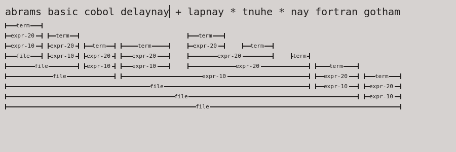

# Little List Editor

This little editor consists of:

 * Few extremely destructive editor commands (put, split, collapse) that operate on text cells bit similar to spreadsheets.
 * Hastily written code.
 * An earley parser based on same papers as Marpa parser.
 * Small test grammar.
 * Editor that uses the parser incrementally to cure up structure after editing commands.
